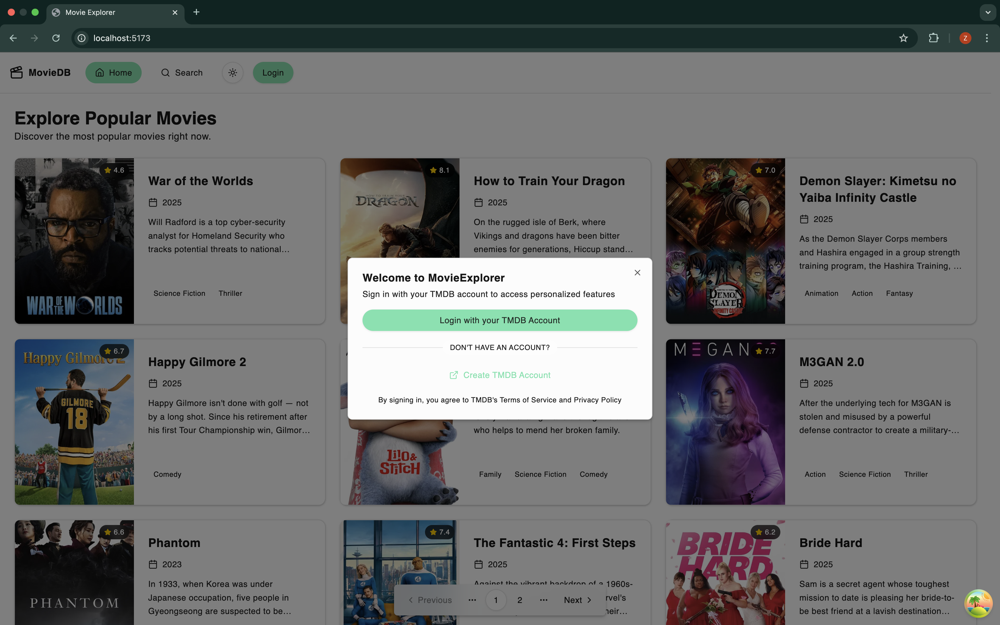
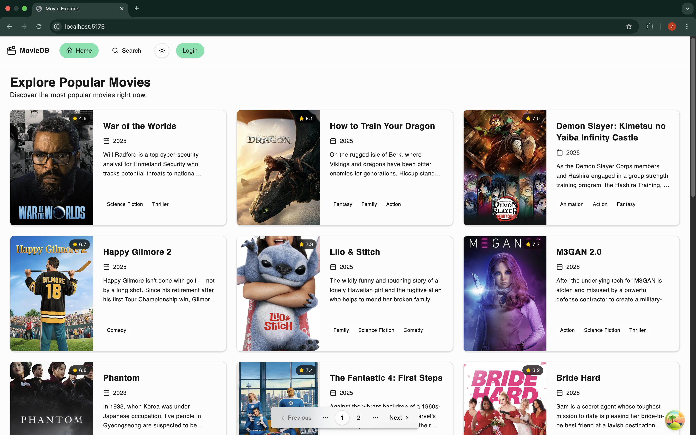
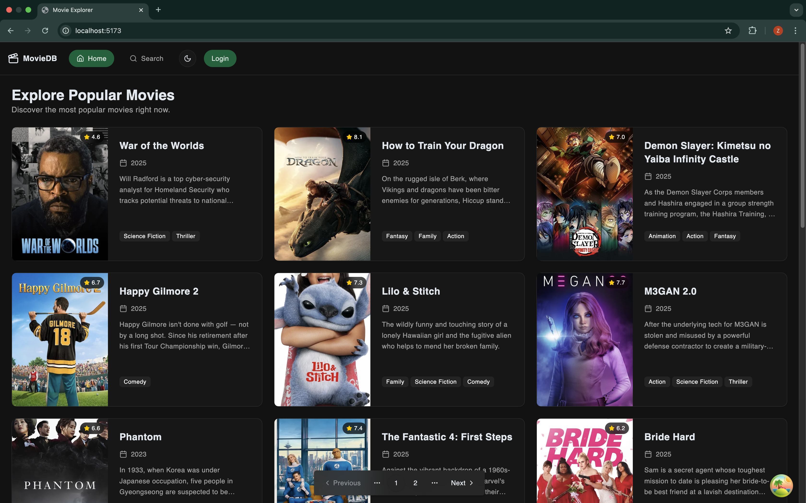
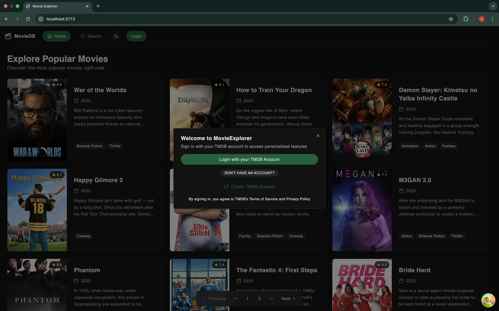
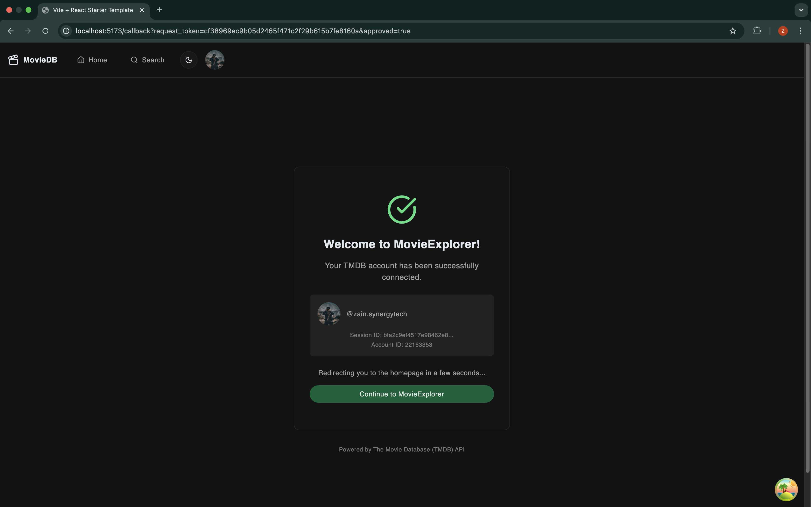
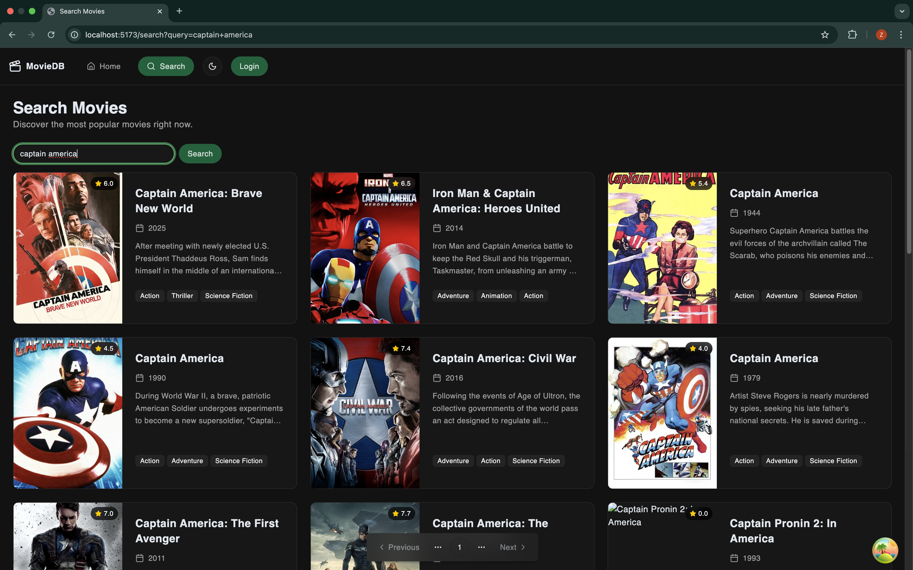

# TMDB Movie Explorer

[](https://opensource.org/licenses/MIT)

A modern, production-ready React application for exploring movies using [The Movie Database (TMDB) API](https://www.themoviedb.org/documentation/api). This project demonstrates best practices in UI development, authentication, data fetching, state management, and code quality, providing a robust foundation for building data-driven React apps.

## Features

- **Movie Discovery & Search**: Browse popular movies and search by title using the TMDB API.
- **Movie Details**: View detailed information, reviews, and recommendations for each movie.
- **Authentication**: Log in with your TMDB account via OAuth for personalized features.
- **Modern UI**: Built with [shadcn/ui](https://ui.shadcn.com/) components and [Tailwind CSS](https://tailwindcss.com/) for a responsive, accessible design.
- **State Management**: Uses [TanStack Query](https://tanstack.com/query/latest) for data fetching/caching and [Zustand](https://zustand-demo.pmnd.rs/) for authentication state.
- **URL State**: Type-safe URL query management with [nuqs](https://nuqs.47ng.com/).
- **Routing**: Client-side navigation with [React Router](https://reactrouter.com/).
- **Code Quality**: Enforced by [Biome](https://biomejs.dev/) and pre-commit hooks via [Husky](https://typicode.github.io/husky/).
- **Path Aliases**: Clean imports with `@/*`.
- **Environment Variables**: Centralized configuration using `.env` files.

## Prerequisites

- Node.js (v18 or higher recommended)
- npm, yarn, or pnpm

## Getting Started

1. **Clone the Repository**

   ```bash
   git clone https://github.com/zainulhassan815/tmdb-movie-explorer.git
   cd tmdb-movie-explorer
   ```

2. **Install Dependencies**

   ```bash
   npm install
   ```

3. **Set Up Environment Variables**
   Copy the example file and update with your TMDB API credentials:

   ```bash
   cp .env.example .env
   ```

   Edit `.env`:

   ```env
   VITE_API_BASE_URL=https://api.themoviedb.org/3
   VITE_API_ACCESS_TOKEN=your_tmdb_access_token
   ```

4. **Set Up Pre-Commit Hooks**
   ```bash
   npm run prepare
   ```

## Available Scripts

- `npm run dev` — Start the development server with hot reloading.
- `npm run build` — Build the app for production.
- `npm run preview` — Preview the production build locally.
- `npm run lint` — Lint the codebase with Biome.
- `npm run lint:fix` — Lint and auto-fix issues.

## Working with shadcn/ui

To add new UI components:

```bash
npx shadcn@latest add <component>
```

Components are placed in `src/components/ui/` for easy import and reuse.

## Code Style & Conventions

- **Formatting**: Enforced by Biome (2-space indents, double quotes, etc.).
- **Linting**: Prevents common mistakes and enforces best practices.
- **File Naming**: Use `kebab-case` for all files (e.g., `movie-card.jsx`). This is enforced by lint rules.

## Project Structure

```text
src
├── api/              # TMDB API integration and Axios instances
├── app/              # Application routes and pages
│   ├── pages/        # Page components (e.g., movie details, search)
│   └── app.jsx       # Main app component
├── assets/           # Static assets (images, fonts, etc.)
├── components/
│   ├── layout/       # Layout components (Header, Footer, etc.)
│   ├── ui/           # shadcn/ui components
│   └── shared/       # Shared/reusable components
├── config/           # App configuration and environment validation
├── hooks/            # Custom React hooks
├── lib/              # Utility functions (e.g., `cn` for classnames)
├── stores/           # Zustand state stores
├── index.css         # Global styles and Tailwind directives
└── main.jsx          # App entry point
```

## Screenshots

### Light Mode

| Login Dialog | Movie Details | Search Results |
| :---: | :---: | :---: |
|  |  |  |

### Dark Mode

| Home Page | Login Dialog | Login Success | Movie Details | Search Results |
| :---: | :---: | :---: | :---: | :---: |
|  |  |  |  |  |

## License

This project is licensed under the MIT License. See the [LICENSE](./LICENSE) file for
